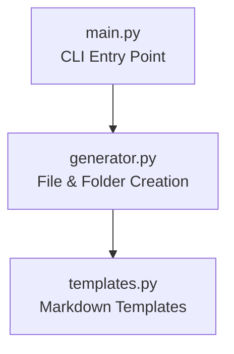

# Architecture

## Folder Structure

```text
src/
├── main.py
├── generator.py
└── templates.py
```

## Component Diagram



## Responsibilities

### main.py
- recibe argumentos
- inicia ejecución

### generator.py
- crea estructura
- escribe archivos

### templates.py
- contiene templates
- centraliza contenido markdown
```

