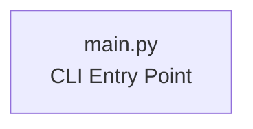

# Architecture

## Folder Structure

```text
src/
├── main.py
```

## Component Diagram


```mermaid
flowchart TD

    A[main.py<br>CLI Entry Point]

    A
```

## Responsibilities

### main.py
- inicia ejecución
- contiene la lógica principal
```
