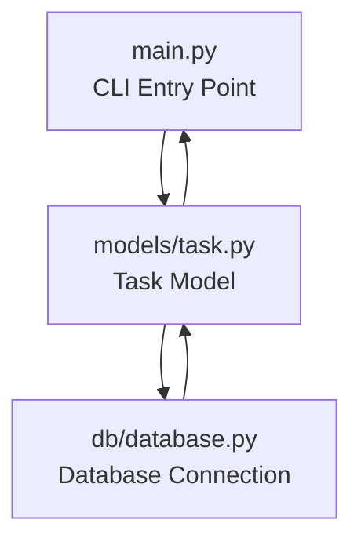

# Architecture

## Folder Structure

```text
task_api/
├── README.md
├── app/
│   ├── models/
│   │   ├── __init__.py
│   │   ├── task.py
│   ├── main.py
│   ├── db/
│   │   ├── __init__.py
│   │   ├── database.py
├── docs/
│   ├── planning.md
│   ├── architecture.md
├── tests/
    ├── test_main.py
├── postman/
│   ├── Task_API.postman_collection.json
├── requirements.txt
├── .env
├── .gitignore
```

## Component Diagram



## Responsibilities

### main.py
- inicia ejecución
- contiene la lógica principal

### models/task.py
- define la estructura de los datos de las tareas

### db/database.py
- maneja la conexión a la base de datos
